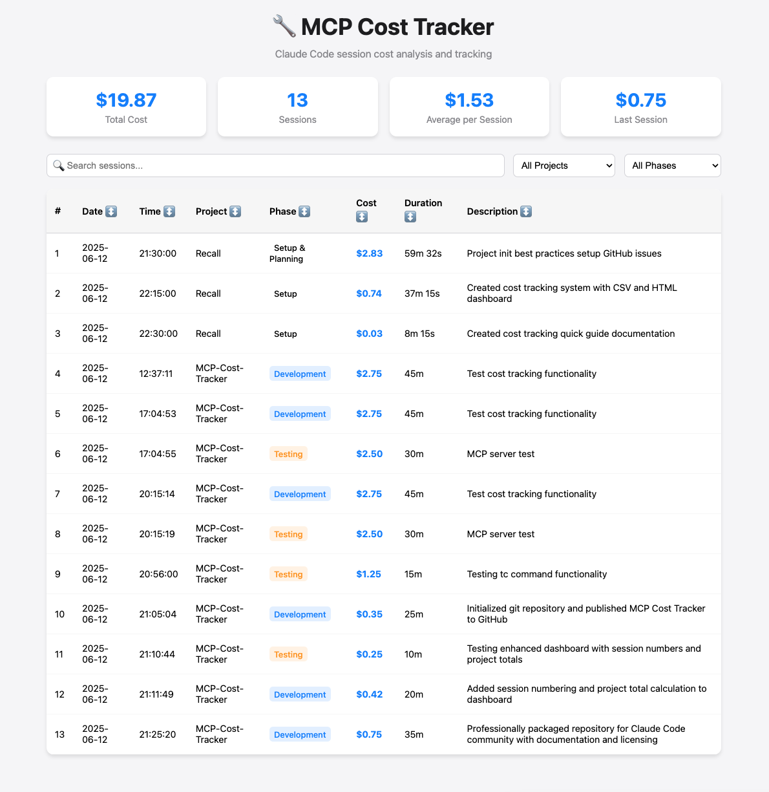

# MCP Cost Tracker

A professional MCP (Model Context Protocol) server for tracking Claude Code usage costs across all your projects. Built for developers who want to monitor and analyze their AI development costs with precision.

## 🚀 Features

- **📊 Session Tracking**: Log costs with session numbers, duration, phase, and descriptions  
- **🌐 Interactive Dashboard**: Beautiful web interface with sorting, filtering, and search
- **📈 Project Analytics**: Calculate total costs per project when filtering
- **🔗 Global MCP Integration**: Access from any Claude Code session across all projects
- **💾 Portable CSV Storage**: Lightweight, version-controllable data format
- **⚡ Command Line Tools**: Quick cost entry and viewing with `/tc`, `/vc`, `/costs`

## 📸 Dashboard Preview



*Interactive dashboard showing session tracking with project filtering and cost analytics*

## 🛠 Installation

### Prerequisites
- Python 3.7+
- Claude Code installed and configured
- Git (for cloning the repository)

### Step 1: Clone Repository
```bash
git clone https://github.com/YOUR_USERNAME/mcp-cost-tracker.git
cd mcp-cost-tracker
```

### Step 2: Set Up Permissions
```bash
# Make command scripts executable
chmod +x commands/*
chmod +x mcp-cost-server
```

### Step 3: Configure Global MCP Server

Add to your **global** Claude Code settings at `~/.config/claude/settings.json`:

```json
{
  "mcpServers": {
    "cost-tracker": {
      "command": "/full/path/to/mcp-cost-tracker/mcp-cost-server",
      "args": []
    }
  }
}
```

**Important**: Replace `/full/path/to/mcp-cost-tracker/` with your actual installation path.

### Step 4: Test Installation

1. **Start Claude Code** in any project
2. **Test MCP connection**: Ask Claude to use the `get_cost_summary` tool
3. **Test local commands**: Run `./commands/costs` from the mcp-cost-tracker directory

## 💡 Usage

### Command Line Interface

From the mcp-cost-tracker directory:

```bash
# Track a new session (interactive prompts)
./commands/tc

# View dashboard in browser  
./commands/vc

# Quick cost summary
./commands/costs
```

### MCP Tools (Available in any Claude Code session)

- **`track_cost`**: Log session costs with structured parameters
- **`get_cost_summary`**: Retrieve total cost statistics  
- **`get_cost_history`**: Get filtered session history
- **`generate_dashboard`**: Update the HTML dashboard

### Example MCP Usage

In any Claude Code session:
```
Use the track_cost tool to log this session with cost 2.50, duration "30m", phase "Development", description "Added user authentication", project "MyApp"
```

## 📊 Data Schema

Sessions are stored in `data/costs.csv`:

```csv
Session,Date,Time,Project,Phase,Cost,Duration,Description,Session_ID
1,2025-06-12,21:30:00,MyProject,Development,2.83,45m,Added new feature,session_001
2,2025-06-12,22:15:00,MyProject,Testing,1.25,20m,Fixed user login bug,session_002
```

## 🏗 Architecture

```
mcp-cost-tracker/
├── src/
│   ├── cost_tracker.py      # Core cost tracking logic
│   └── mcp_server.py        # MCP protocol implementation
├── commands/
│   ├── config.sh           # Shared configuration
│   ├── tc                  # Track costs command
│   ├── vc                  # View dashboard command
│   └── costs               # Quick summary command
├── data/
│   └── costs.csv           # Cost data storage
├── web/
│   └── costs.html          # Generated dashboard
└── mcp-cost-server         # Global MCP server launcher
```

## 🔧 Advanced Configuration

### Custom Data Directory
```bash
# Use custom data location
python src/mcp_server.py --data-dir /path/to/custom/data
```

### Dashboard Customization
The dashboard auto-generates from CSV data. To customize:
1. Modify `commands/generate-dashboard` 
2. Update HTML template and JavaScript
3. Run `./commands/generate-dashboard` to rebuild

## 🤝 Contributing

1. Fork the repository
2. Create a feature branch: `git checkout -b feature-name`
3. Commit changes: `git commit -am 'Add feature'`
4. Push to branch: `git push origin feature-name`
5. Submit a Pull Request

## 📝 License

MIT License - see [LICENSE](LICENSE) file for details.

## 👨‍💻 Author

**Gilbert King**  
- GitHub: [@kingigilbert](https://github.com/kingigilbert)
- Company: Ignite Studios Ltd

## 🐛 Issues & Support

- **Bug Reports**: [GitHub Issues](https://github.com/YOUR_USERNAME/mcp-cost-tracker/issues)
- **Feature Requests**: [GitHub Discussions](https://github.com/YOUR_USERNAME/mcp-cost-tracker/discussions)
- **Documentation**: See [setup-global-mcp.md](setup-global-mcp.md) for detailed MCP configuration

## 🙏 Acknowledgments

Built with [Claude Code](https://claude.ai/code) - AI-powered development tool by Anthropic.

---

**⭐ Star this repository if it helps you track your AI development costs!**